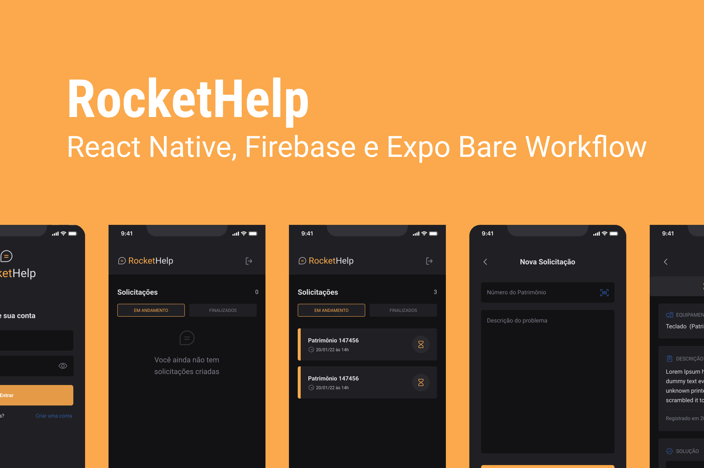

Aplicativo de solicitações de manutenção de equipamentos internos de uma empresa.  
Neste app, você pode criar uma solicitação e receber a solução em tempo real.

## 🚀 Tecnologias:

- **[React Native](https://reactnative.dev/)**
- **[TypeScript](https://www.typescriptlang.org/)**
- **[Expo Bare Workflow](https://docs.expo.dev/bare/exploring-bare-workflow/)**


## 📚 Bibliotecas:

- **[Native Base](https://nativebase.io/)**
- **[React Native Firebase](https://rnfirebase.io/)**
- **[Expo Barcode Scanner](https://docs.expo.dev/versions/latest/sdk/bar-code-scanner/)**
- **[React Navigation](https://reactnavigation.org/)**
- **[Phosphor Icons](https://github.com/duongdev/phosphor-react-native)**
- **[React Native SVG Transformer](https://github.com/kristerkari/react-native-svg-transformer)**
- **[Expo Google Fonts](https://github.com/expo/google-fonts)**

## 🧠 Aprendizado:

- **Expo Bare Workflow** que nos permite adicionar código nativo (Android e iOS) sem perder as facilidades do Expo e ainda utilizando **TypeScript** para melhorar a produtividade, e até encontrar erros no código facilmente.
- **Native Base** foi o coração desta aplicação em relação a interface. É uma biblioteca de componentes que foi usada em lugar dos principais core components.
- Como o React Native, por padrão, não aceita svg, foi utilizado o **React Native SVG Transformer** para poder importar esses arquivos e usar com sintaxe de componente. Tipagem também foi acrescentado ao TypeScript para que ele reconheça a extensão svg.
- Para facilitar a digitação do patrimônio, foi adicionado **Expo Barcode Scanner**, que é um leitor de códigos de barra (também aceita qr code).
- Quase finalizando, foi utilizado o ```expo prebuild```, neste ponto não era mais possível usar o aplicativo Expo Go (sem suporte ainda), devido a introdução do **Firebase**. Porém, ainda com a ajuda do Expo, podemos utilizar plugins para automatizar a implementação desses códigos.

## 🧪 Experimente:

Você pode experimentar esse app em sua máquina, fazendo um clone do projeto:   
NOTA: É necessário ter todo o ambiente de desenvolvimento configurado antes.
```bash 
git clone https://github.com/Tamar-J/rockethelp   
```
Depois execute as seguintes ações de linha de comando:
```bash
cd rockethelp
npm install
```
NOTA: Por motivos de segurança, foi retirado os arquivos de configuração do firebase *google-services.json* (android) e *GoogleService-Info.plist* (ios). Para testar, você deve baixar seus próprios arquivos de configuração em sua conta no [firebase](https://console.firebase.google.com/) registrando o aplicativo com o nome do pacote ```com.rockethelp```. Neste projeto foi usado autenticação por e-mail e senha.
Deixe os arquivos baixados, na raiz do projeto.   
Em seguida execute estes comandos:
```bash
expo prebuild
expo run:android
```
OBS: Este processo pode levar um tempo.   
OBS²: Devido a falta de equipamento, não foi possível testar no iOS, mas você pode testar usando os mesmos comandos acima, porém substituindo ```run:android``` por ```run:ios```. Se houver erros, por favor, entrar em contato.

## FAQ 

### *De onde saiu o design do app?*

O design foi desenvolvido pela equipe da Rocketseat no evento Ignite Lab e modificado por mim.

### *Este projeto foi de evento?*

Originalmente sim, pela [Rocketseat](https://www.rocketseat.com.br/). O objetivo é aprender com mestres dessa tecnologia e fazer modificações pessoais.

### *Quais foram as mudanças?*

- Código foi refatorado 
- Cores do layout 
- Leitor de código de barras
- Vibração adicionada para um melhor feedback de ações
- Tela de criação de contas
- O usuário pode escolher revelar a senha digitada na tela de login